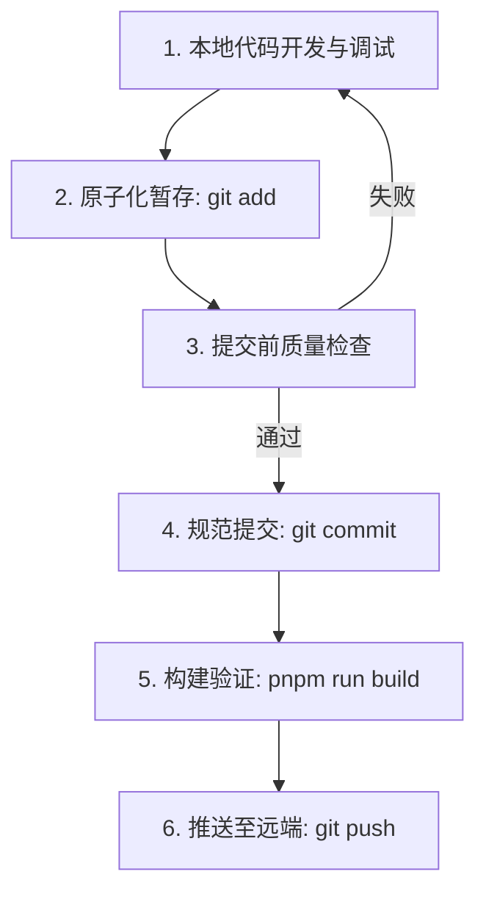

# Git 提交规范与工作流指南

本指南为 `wsr-flash-card` 项目定制，旨在保障代码库提交历史的清晰性、可追溯性以及工程质量。

---

## 1. Commit Message 规范

提交信息严格遵循 [Conventional Commits 1.0.0](https://www.conventionalcommits.org/) 规范。

### 1.1 基础格式

```text
<type>(<scope>): <subject>

[可选 body: 详细说明改动背景、关键决策或实现细节]

[可选 footer: 关联 Issue 或声明破坏性改动]
```

### 1.2 Type（提交类型）

| Type           | 说明                             | 适用场景示例                                           |
| :------------- | :------------------------------- | :----------------------------------------------------- |
| **`feat`**     | 新增功能 (Feature)               | 新增拼写练习模式、支持拖拽排序列表、新增自动发音开关   |
| **`fix`**      | Bug 修复                         | 修复练习模式输入范围计算错误、修复暗色模式文字颜色异常 |
| **`style`**    | UI/样式调整 或 纯格式变化        | 调整卡片弹窗圆角与间距、代码格式化（Oxfmt）            |
| **`refactor`** | 重构（既不新增功能也不修复 Bug） | 提取发音逻辑到独立 Runtime、优化 Session 状态机流转    |
| **`perf`**     | 性能优化                         | 优化大数据量卡片解析速度、改进 IndexedDB 音频缓存读取  |
| **`test`**     | 测试相关                         | 新增 Parser 单元测试、修复 Vitest 断言                 |
| **`docs`**     | 文档更新                         | 更新 README、AGENTS.md、CONTEXT.md、开发文档           |
| **`chore`**    | 构建/依赖/配置变动               | 升级依赖库、调整 Vite/Oxlint 配置、版本号 bump         |
| **`revert`**   | 代码回滚                         | 撤销某次有问题的 commit                                |

### 1.3 Scope（模块作用域）

请根据修改涉及的代码模块填写对应 Scope：

| Scope                           | 对应目录 / 模块                  | 说明                                                  |
| :------------------------------ | :------------------------------- | :---------------------------------------------------- |
| **`ui`**                        | `src/ui/`                        | React 界面组件、弹窗、交互面板                        |
| **`styles`**                    | `src/styles/`                    | CSS 样式表、主题与深浅色适配                          |
| **`cards`** / **`parser`**      | `src/cards/`                     | Markdown 闪卡解析规则、语法解析、格式化               |
| **`identity`**                  | `src/identity/`                  | 卡片 UUID 稳定性、来源变更对齐与迁移                  |
| **`session`**                   | `src/sessions/`                  | 学习/复习/练习/拼写流程、FSRS 算法调度器              |
| **`pronunciation`**             | `src/pronunciation/`             | TTS 语音合成、本地语音、Azure/OpenAI 提供商、音频缓存 |
| **`deck`**                      | `src/decks/`                     | 牌组管理、PDF 导出功能                                |
| **`obsidian`**                  | `src/obsidian/`                  | Obsidian View 生命周期、命令注册、设置选项面板        |
| **`settings`**                  | `src/settings/`                  | 设置 ViewModel、数据持久化设置                        |
| **`storage`**                   | `src/storage/`                   | `DataStore` 数据存储与迁移                            |
| **`history`** / **`word-list`** | `src/history/`, `src/wordList/`  | 学习历史记录、生词表                                  |
| **`i18n`**                      | `src/i18n/`                      | 中英文语言包与多语言文案                              |
| **`deps`**                      | `package.json`                   | 依赖升级/变更                                         |
| **`release`**                   | `manifest.json`, `versions.json` | 版本发布                                              |

> 若改动涉及全局或跨多模块，可省略 `(<scope>)`，如 `refactor: optimize error handling`。

### 1.4 Subject（简短描述）要求

1. **清晰明确**：一句话说明本次变更的核心目的，杜绝 `ui update`、`fix bug`、`update` 等模糊词汇。
2. **动词开头**：
    - 中文：如 `新增...`、`修复...`、`优化...`、`调整...`。
    - 英文：如 `add ...`、`fix ...`、`improve ...`、`refactor ...`。
3. **结尾不加句号**。
4. **长度建议**：简短有力，控制在 50~72 个字符以内。

---

## 2. 案例对比（Bad vs Good）

| ❌ 不推荐（模糊/无规范）                          | ✔️ 推荐（规范/清晰）                                                      |
| :------------------------------------------------ | :------------------------------------------------------------------------ |
| `style: ui update`                                | `style(ui): adjust card review button padding and font size`              |
| `style: update ui`                                | `fix(ui): resolve dark mode contrast issue in spelling input`             |
| `style: clean up css`                             | `style(styles): remove unused animation classes from pronunciation modal` |
| `style: format code`                              | `chore: format codebase with oxfmt`                                       |
| `feat: add auto speech switch`                    | `feat(pronunciation): add auto speech toggle in deck study settings`      |
| `fix: fix practice input range of practice model` | `fix(session): correct practice session input range boundary calculation` |
| `chore: upgrade dependencies`                     | `chore(deps): bump react to 19.2.8 and ts-fsrs to 5.4.1`                  |

---

## 3. 标准提交流程（Workflow）



### 3.1 原子化提交原则（Atomic Commits）

- **单一职责**：每次 commit 只包含一个独立的逻辑改动。不要将不相关的重构、UI 微调与 Bug 修复混合在同一次 commit 中。
- **独立可运行**：确保每一个 commit 节点都能独立通过 build 和单元测试，便于后续 `git bisect` 排查问题或 `git revert`。

### 3.2 提交前质量门禁（Pre-commit Checklist）

在执行提交前，请确保运行并通过以下检查：

```bash
# 格式检查
pnpm run format:check

# 类型检查与 Lint 检查
pnpm run lint

# 单元测试（涉及逻辑变更时）
pnpm run test

# 综合一键检查
pnpm run check:all
```

> **注意**：项目已配置 Git Hooks，每次 `git commit` 时会自动触发 `pre-commit`（代码格式 & lint 检查）与 `commit-msg`（规范校验）。

---

## 4. 版本发布流程（Release Workflow）

发布 Obsidian 插件新版本时，遵循以下规范化步骤：

```bash
# 1. 运行全量测试与构建检查
pnpm run check:all
pnpm run build

# 2. 更新版本号
#    pnpm release:* 会 bump package.json，运行 scripts/version-bump.mjs 同步
#    manifest.json 与 versions.json，并创建 release commit 与不带 v 前缀的 tag
pnpm release:patch   # 小修补 4.5.0 -> 4.5.1
# 或 pnpm release:minor # 新功能 4.5.0 -> 4.6.0
# 或 pnpm release:major # 主版本 4.5.0 -> 5.0.0

# 3. 检查自动创建的 release commit 与 tag，然后推送
git push origin main --tags
```

> **注意**：不要用 `npm version` 代替 `pnpm release`。`release` 脚本带有 `--tag-version-prefix ""`，产出的 tag 与 `package.json` 版本一致；`npm version` 默认加 `v` 前缀，会被 `.github/workflows/release.yml` 的版本校验拦下。
